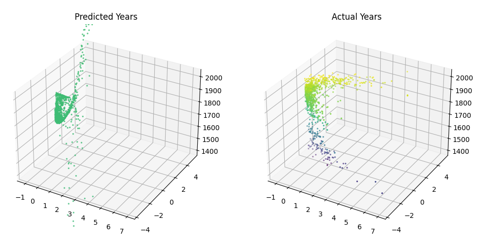

# CS461 HW2 Samples
Some code samples from Machine Learning Principles HW2, relating to Regression, Principal Component Analysis, and Cross-Fold Validation.

## P1: MMSE Regression

`p1.py` computes the MMSE solution for a small linear regression problem using two methods.

### Normal Equation and Rank Check

The design matrix $\Phi$ is constructed with a bias term, and its rank is checked with `numpy.linalg.matrix_rank`. Since $\Phi^\top \Phi$ is rank deficient, the exact inverse does not exist, so an approximate solution is required.

### Pseudoinverse Solution

Using `numpy.linalg.pinv`, the script computes the weight vector $w=(\Phi^\top\Phi)^{+}\Phi^\top y$ and prints the result.

### Spectral Decomposition

The file also implements a custom solution using eigen-decomposition. Both solutions are compared with `np.allclose`, confirming they match up to floating point error.

## P3: Learning Sinusoidal Functions

This section includes three main scripts: `ols_regression.py`, `ridge_regression.py`, and `ols_vs_ridge.py`, which work to test regression models on fitting a sinusoidal function.

### Ordinary Least Squares

`ols_regression.py` runs MMSE regression on the sinusoid dataset with 25 training points, using 5-fold validation. It computes the average validation error to be $MSE\approx0.688$.

### Ridge Regression

`ridge_regression.py` evaluates the following lambda values: $\lambda=[1e-8, 1e-7, 1e-6, 1e-5, 1e-4, 1e-3, 1e-2, 1e-1, 0.5, 1]$

Each value is trained and evaluated on the same 25-point training set with 5-fold cross-validation. The script plots average validation error and selects the lambda that minimizes it.

  

In this case $\lambda=10^{-4}$ minimized the MSE.

### Model Comparison

`ols_vs_ridge.py` loads both sets of weights and maps them over a dense x-range. It produces a comparison plot that highlights how ridge reduces overfitting and smooths the function.

  

On the edges of the range, it can be seen that the model with $\lambda=0$ fails to generalize, and goes way off of a normal sinusoidal function. Also, for both models an averaged weight was found for the 5 folds, running a test to find the average MSE for both:

$w(\lambda=0): MSE=0.4441293406629071$

$w(\lambda*): MSE = 0.037604624960812676$

### Base Model

I also tested a model that had no regularization or cross validation using 100 training points instead of the earlier 25 points, plotting the results:

  

It can be seen that another way to effectively reduce error is to introduce more training points, reducing the necessity of regularization.

## P4: Eigenfaces

`p4.py` computes eigenfaces using PCA on a dataset of aligned grayscale face images. All training images in `P4_data/train` are loaded with PIL, converted to arrays, flattened, and stored in a single data matrix. After stacking the images, the mean face vector is computed and subtracted from every image. The covariance matrix is then calculated with

$COV=\frac{1}{N-1}(X-\mu)^\top(X-\mu)$,

where each row of $X$ corresponds to a flattened image. The script prints the shape of the mean vector, the covariance matrix, and the number of eigenvalues.

The eigenvalues and eigenvectors of the covariance matrix are computed using `numpy.linalg.eigh`, then sorted in descending order so that the top components correspond to the directions of greatest variance. These leading eigenvectors are the "eigenfaces", which highlight the major modes of variation across the dataset.

### Reconstruction

A test image (`subject14.surprised`) is loaded, flattened, centered, and reconstructed using different values of $M$, the number of principal components. For each $M$, the script:

1. Takes the top $M$ eigenvectors.
2. Projects the centered test image onto them.
3. Reconstructs the image from this projection.

The reconstructions are plotted with the magma colormap:

 
   

As $M$ increases, the reconstruction becomes sharper and captures more detail, since more principal components are included.

### Top 10 Eigenfaces

Finally, the script reshapes the top 10 eigenvectors into 60x80 images and normalizes them for visualization. These eigenfaces show the dominant features shared across the training images, such as overall face structure and lighting patterns.

 
   

## P5: Estimation of Year Made

`p5.py` performs PCA on the VGG16 logit features provided for paintings, with the goal of visualizing the data in lower dimensions and then building a regression model to estimate the year a painting was created.

### PCA on VGG16 Logits

The script loads `vgg16_train.npz` and `vgg16_test.npz`, concatenates them for PCA, and centers the logits. The covariance matrix is computed, followed by eigen-decomposition using `numpy.linalg.eigh`. The eigenvalues and eigenvectors are then sorted from largest to smallest.

Using the top principal components, the script produces 1D and 2D PCA visualizations:

 
   

In the 1D case, almost all points collapse near $x=0$, making it difficult to perform meaningful regression on this projection alone. The 2D PCA plot offers much more spread since it includes the second principal component, giving a more stable representation for downstream modeling.

### Polynomial Regression Model

To predict year from PCA features, a polynomial basis function was implemented for the 2D case in `year_train.py`. This allowed testing models of various degrees by generating the design matrix $\Phi$ with different polynomial expansions.

A validation set of size 200 was taken from the training data, without using any cross-validation or regularization. By increasing the polynomial degree, the validation MSE was recorded for each model. Around degree 5, the validation loss began to level off, indicating that higher degrees would likely overfit.

 
   

Using degree 5 yielded a validation MSE of $\approx5582.51$ (off by $\approx75$ years). The eigenvectors, eigenvectors, and mean from training were saved in `pca_paramz.npz` to be used for PCA in testing.

### Testing and Evaluation

The final model (degree 5) was evaluated on the provided test set in `year_test.py`. The resulting MSE was $\approx6531.58$ (off by $\approx81$ yaers), suggesting that the model overfitted the training data slightly. This indicates that further regularization or more training samples would be required to achieve even stable year predictions.

 
   

The most accurate prediction was on `3689_crimea-gazebo-1929.jpg`, with squared error $\approx0.27$ (off by $\approx0.5$ years). The least accurate prediction was on `847_polyptych-of-st-luke-1455.jpg`, with a squared error of 184608 (off by $\approx429$ years), highlighting the difficulty of the task.